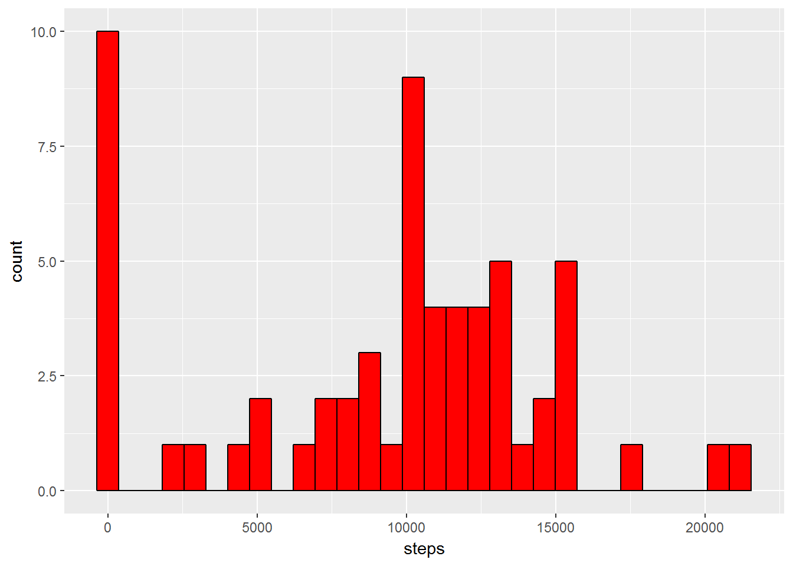
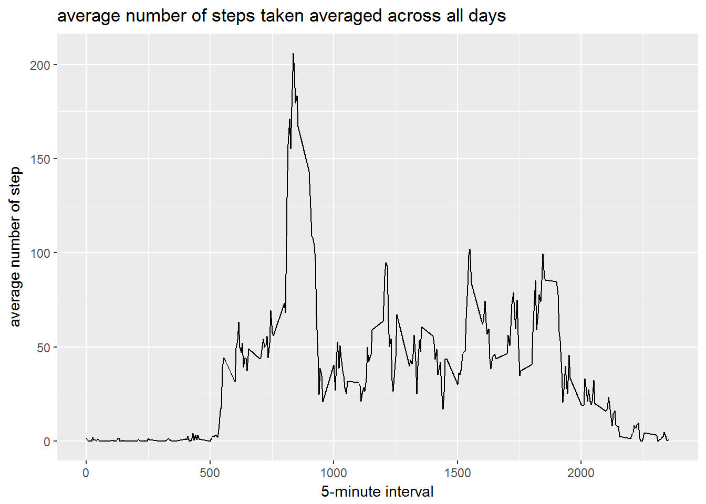
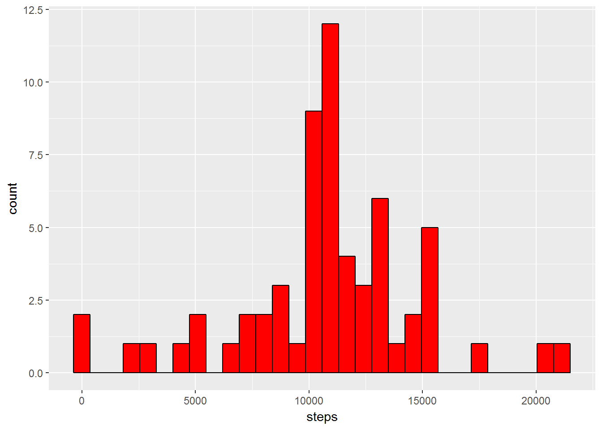
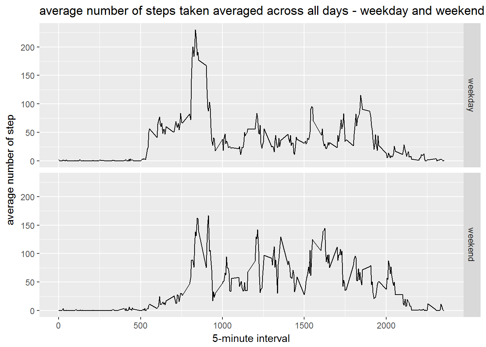

Reproducible Research: Peer Assessment 1
================
jetzgetzlos
6 avril 2017

Reproducible research - Project 1 (week2)
-----------------------------------------

### Loading and preprocessing the data

Unzip the dataset then load the csv file

``` r
unzip("repdata_data_activity.zip")
activity <- read.csv("activity.csv")
```

Show the first rows and some stats about the dataset

``` r
head(activity)
```

    ##   steps       date interval
    ## 1    NA 2012-10-01        0
    ## 2    NA 2012-10-01        5
    ## 3    NA 2012-10-01       10
    ## 4    NA 2012-10-01       15
    ## 5    NA 2012-10-01       20
    ## 6    NA 2012-10-01       25

``` r
str(activity)
```

    ## 'data.frame':    17568 obs. of  3 variables:
    ##  $ steps   : int  NA NA NA NA NA NA NA NA NA NA ...
    ##  $ date    : Factor w/ 61 levels "2012-10-01","2012-10-02",..: 1 1 1 1 1 1 1 1 1 1 ...
    ##  $ interval: int  0 5 10 15 20 25 30 35 40 45 ...

Convert the column `data` into date format

``` r
activity$date <- as.Date(strptime(activity$date, format = "%Y-%m-%d"))
str(object = activity) 
```

    ## 'data.frame':    17568 obs. of  3 variables:
    ##  $ steps   : int  NA NA NA NA NA NA NA NA NA NA ...
    ##  $ date    : Date, format: "2012-10-01" "2012-10-01" ...
    ##  $ interval: int  0 5 10 15 20 25 30 35 40 45 ...

### What is mean total number of steps taken per day ?

For this part of the assignment, we can ignore the missing values in the dataset.

**Calculate the total number of steps taken per day **

``` r
library(dplyr, verbose = F, warn.conflicts = FALSE)
```

    ## Warning: package 'dplyr' was built under R version 3.3.3

``` r
activity_by_day <- group_by(activity, date)
average_daily_activity <- summarize(activity_by_day, steps=sum(steps,na.rm=TRUE))
print(average_daily_activity)
```

    ## # A tibble: 61 × 2
    ##          date steps
    ##        <date> <int>
    ## 1  2012-10-01     0
    ## 2  2012-10-02   126
    ## 3  2012-10-03 11352
    ## 4  2012-10-04 12116
    ## 5  2012-10-05 13294
    ## 6  2012-10-06 15420
    ## 7  2012-10-07 11015
    ## 8  2012-10-08     0
    ## 9  2012-10-09 12811
    ## 10 2012-10-10  9900
    ## # ... with 51 more rows

**Make a histogram of the total number of steps taken each day **

``` r
library(ggplot2)
```

    ## Warning: package 'ggplot2' was built under R version 3.3.3

``` r
g <- ggplot(average_daily_activity, aes(steps)) + geom_histogram(fill = "red", color = "black")
print(g)
```

    ## `stat_bin()` using `bins = 30`. Pick better value with `binwidth`.



**Calculate and report the mean and median of the total number of steps taken per day **

``` r
mean_steps <- mean(average_daily_activity$steps,na.rm=TRUE)
mean_steps
```

    ## [1] 9354.23

``` r
median_steps <- median(average_daily_activity$steps,na.rm=TRUE)
median_steps
```

    ## [1] 10395

``` r
#avoir scientific display
options(scipen=999)
```

mean : 9354

median : 10395

### What is the average daily activity pattern?

**Make a time series plot (i.e. type = "l") of the 5-minute interval (x-axis) and the average number of steps taken, averaged across all days (y-axis)**

Data preparation

``` r
activity_by_interval <- group_by(activity, interval)
daily_act_pattern <- summarize(activity_by_interval, av_steps=mean(steps,na.rm=TRUE))
head(daily_act_pattern)
```

    ## # A tibble: 6 × 2
    ##   interval  av_steps
    ##      <int>     <dbl>
    ## 1        0 1.7169811
    ## 2        5 0.3396226
    ## 3       10 0.1320755
    ## 4       15 0.1509434
    ## 5       20 0.0754717
    ## 6       25 2.0943396

``` r
g <- ggplot(daily_act_pattern, aes(interval, av_steps)) +
    geom_line() +
    xlab("5-minute interval") +
    ylab("average number of step")+
    labs(title = "average number of steps taken averaged across all days")
print(g)
```



**Which 5-minute interval, on average across all the days in the dataset, contains the maximum number of steps?**

``` r
max_interval <- filter(daily_act_pattern,av_steps==max(av_steps))
head(max_interval)
```

    ## # A tibble: 1 × 2
    ##   interval av_steps
    ##      <int>    <dbl>
    ## 1      835 206.1698

The interval num 835 contains the maximum number of steps (206).

### Imputing missing values

**Calculate and report the total number of missing values in the dataset (i.e. the total number of rows with NAs)**

``` r
na_num <- sum(is.na(activity))
na_num
```

    ## [1] 2304

``` r
na_pc <- sum(is.na(activity))/nrow(activity)*100
na_pc 
```

    ## [1] 13.11475

There are 2304 missing values in the dataset (about 13 %). It's a significant issue. So, we can't ignore them.

**Devise a strategy for filling in all of the missing values in the dataset. The strategy does not need to be sophisticated. For example, you could use the mean/median for that day, or the mean for that 5-minute interval, etc.**

My strategy : Replace the missing values by the mean of steps for the considered interval.

**Create a new dataset that is equal to the original dataset but with the missing data filled in.**

``` r
replace_by_mean <- function(interval,step){
    
   if (!is.na(step)) {
       return(step)
   } else {
       return (as.numeric(daily_act_pattern[daily_act_pattern$interval == interval,"av_steps"]))
   }
}

activity_filled <- activity
activity_filled$steps <- mapply(replace_by_mean, activity$interval, activity$steps)
```

**Make a histogram of the total number of steps taken each day and Calculate and report the mean and median total number of steps taken per day. Do these values differ from the estimates from the first part of the assignment? What is the impact of imputing missing data on the estimates of the total daily number of steps?**

``` r
activity_by_day_filled <- group_by(activity_filled, date)
average_daily_activity_filled <- summarize(activity_by_day_filled, steps=sum(steps,na.rm=TRUE))
print(average_daily_activity_filled)
```

    ## # A tibble: 61 × 2
    ##          date    steps
    ##        <date>    <dbl>
    ## 1  2012-10-01 10766.19
    ## 2  2012-10-02   126.00
    ## 3  2012-10-03 11352.00
    ## 4  2012-10-04 12116.00
    ## 5  2012-10-05 13294.00
    ## 6  2012-10-06 15420.00
    ## 7  2012-10-07 11015.00
    ## 8  2012-10-08 10766.19
    ## 9  2012-10-09 12811.00
    ## 10 2012-10-10  9900.00
    ## # ... with 51 more rows

``` r
library(ggplot2)
g <- ggplot(average_daily_activity_filled, aes(steps)) + geom_histogram(fill = "red", color = "black")
print(g)
```

    ## `stat_bin()` using `bins = 30`. Pick better value with `binwidth`.



``` r
mean_steps_n <- mean(average_daily_activity_filled$steps,na.rm=TRUE)
mean_steps_n
```

    ## [1] 10766.19

``` r
median_steps_n <- median(average_daily_activity_filled$steps,na.rm=TRUE)
median_steps_n
```

    ## [1] 10766.19

``` r
options(scipen=999)
```

mean : 10766 (old value: 9354)

median : 10766 (old value:10395)

yes, these values differ from the estimates from the first part.

The impact of imputing daly data is to increase the mean and median values. The impact is also to increase the total daily number of steps.

### Are there differences in activity patterns between weekdays and weekends?

Using the filled dataset

**Create a new factor variable in the dataset with two levels - "weekday" and "weekend" indicating whether a given date is a weekday or weekend day.**

First, set the week names in English

``` r
Sys.setlocale("LC_TIME", "English")
```

    ## [1] "English_United States.1252"

``` r
weekend_or_weekday <- function(date) {
    
    if (weekdays(date) == "Saturday" | weekdays(date) == "Sunday") {
        return("weekend")
    } else {
        return("weekday")
    }
}

activity_filled$day_type <- mapply(weekend_or_weekday, activity_filled$date)
head(activity_filled)
```

    ##       steps       date interval day_type
    ## 1 1.7169811 2012-10-01        0  weekday
    ## 2 0.3396226 2012-10-01        5  weekday
    ## 3 0.1320755 2012-10-01       10  weekday
    ## 4 0.1509434 2012-10-01       15  weekday
    ## 5 0.0754717 2012-10-01       20  weekday
    ## 6 2.0943396 2012-10-01       25  weekday

``` r
print(activity_filled[7485:7500,])
```

    ##      steps       date interval day_type
    ## 7485     0 2012-10-26     2340  weekday
    ## 7486     0 2012-10-26     2345  weekday
    ## 7487     0 2012-10-26     2350  weekday
    ## 7488     0 2012-10-26     2355  weekday
    ## 7489     0 2012-10-27        0  weekend
    ## 7490     0 2012-10-27        5  weekend
    ## 7491     0 2012-10-27       10  weekend
    ## 7492     0 2012-10-27       15  weekend
    ## 7493     0 2012-10-27       20  weekend
    ## 7494     0 2012-10-27       25  weekend
    ## 7495     0 2012-10-27       30  weekend
    ## 7496     0 2012-10-27       35  weekend
    ## 7497     0 2012-10-27       40  weekend
    ## 7498     0 2012-10-27       45  weekend
    ## 7499     0 2012-10-27       50  weekend
    ## 7500     0 2012-10-27       55  weekend

``` r
#Set the factors
activity_filled <- transform(activity_filled, day_type = factor(day_type) )
str(activity_filled)
```

    ## 'data.frame':    17568 obs. of  4 variables:
    ##  $ steps   : num  1.717 0.3396 0.1321 0.1509 0.0755 ...
    ##  $ date    : Date, format: "2012-10-01" "2012-10-01" ...
    ##  $ interval: int  0 5 10 15 20 25 30 35 40 45 ...
    ##  $ day_type: Factor w/ 2 levels "weekday","weekend": 1 1 1 1 1 1 1 1 1 1 ...

**Make a panel plot containing a time series plot (i.e. type = "l") of the 5-minute interval (x-axis) and the average number of steps taken, averaged across all weekday days or weekend days (y-axis).**

Data Preparation with dplyr library as usual

``` r
activity_filled_by_interval <- group_by(activity_filled, interval,day_type)
daily_act_pattern_filled <- summarize(activity_filled_by_interval, av_steps=mean(steps,na.rm=TRUE))
head(daily_act_pattern_filled)
```

    ## Source: local data frame [6 x 3]
    ## Groups: interval [3]
    ## 
    ##   interval day_type   av_steps
    ##      <int>   <fctr>      <dbl>
    ## 1        0  weekday 2.25115304
    ## 2        0  weekend 0.21462264
    ## 3        5  weekday 0.44528302
    ## 4        5  weekend 0.04245283
    ## 5       10  weekday 0.17316562
    ## 6       10  weekend 0.01650943

``` r
g <- ggplot(daily_act_pattern_filled, aes(interval, av_steps, fill=day_type),) +
    geom_line() +
    facet_grid(day_type ~ .) +
    xlab("5-minute interval") +
    ylab("average number of step")+
    labs(title = "average number of steps taken averaged across all days - weekday and weekend")
print(g)
```


